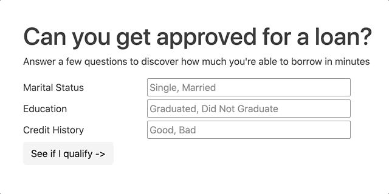
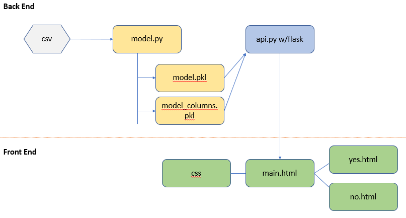

# Loan Prediction Model 

## Project Members
* Anastasia
* Anna
* Catie
* Masita 
* Matthew
 

<h1 align="center"> ️Contributers </h1>

 [  <b>Anastasia V</b>](https://github.com/AnastasiaRV)  
 [  <b>Anna Givens</b>](https://github.com/heyannag)  
 [  <b> Masita M </b>](https://github.com/masitamohamad)  
[  <b> Catie C </b>](https://github.com/csidneyclark)  

## Machine Learning Model Project Plan 

* [Database Discovery](#DatabaseDiscovery)
* [Define the Problem](#DefinetheProblem)  
* [Machine Learning | Model Selection](#MachineLearningmodelselection)
* [Train and Test Model](#TrainandTestModel)
* [Tune the Training Model](#TunetheTrainingModel)
* [Apply Chosen Model](#ApplyChosenModel)
* [Save and Load Model | scikit-learn](#SaveandLoadModelscikit-learn)
* [Python File to Serve the Data](#PythonFiletoServetheData)
* [Develop index.html](#Developindex.html)

# Database Discovery 
Source of Dataset: The dataset for this project is retrieved from [Kaggle](https://www.kaggle.com/altruistdelhite04/loan-prediction-problem-dataset), the home of Data Science. 

Columns | Description | Key Parameter Y/N
:-----|:----- |:-----:
`Loan_ID` | Unique Load ID | N
`Gender` | Male/Female | N
`Married`| Married(yes)/Not Married(no) | Y
`Dependents`| Number of Dependants Claimed by Applicant | Y
`Education` | Education Level of Applicant (Graduate/Undergraduate) | Y
`Self_Employed`| If the Applicant is Self-Employed (yes/no) | N
`Applicant_Income` | Applicant Annual Income | Y
`Coapplicant_Income` | Co-Applicant's Income | N
`Loan_Amount`| Loan Amount in Thousands | Y
`Loan_Amount_Term` | Loan Term in Months | N
`Credit_History`| Meets Criteria (1;0) | N
`Property_Area` | Urban, Semi-Urban and Rural | Y
`Loan_Status` | Approved (yes/no) | Y

## Linear Regression 
The problem at hand: The major aim of this project is to predict which of the customers will receive a loan or not. Therefore, this is a supervised classification problem to be trained with algorithms like:
Logistic Regression

Predictor problem – linear regression will answer “based on your income what do you qualify for ”Machine Learning Model Selection
Linear regression

## Presentation
GitHub readme populated with key technical information (visuals) on our process of discovery, analysis, and model selection.
Website:
1.Landing page HTML where visitors to the website will interact with the website and enter answers to the key binary predictor parameters (Married, Income, Property, Dependents, Education) 
2.HTML page for “NO you do not qualify” – very dramatic red
3.HTML page for “YES you do qualify, now let’s find out how much of a loan youwill qualify for”
a.This is the page that will use the linear regression model using the two key parameters for Income, Loan Amountb.Visitors to the site will enter an income amount and the site will output the probable loan amount they will qualify for

## How it all works together

