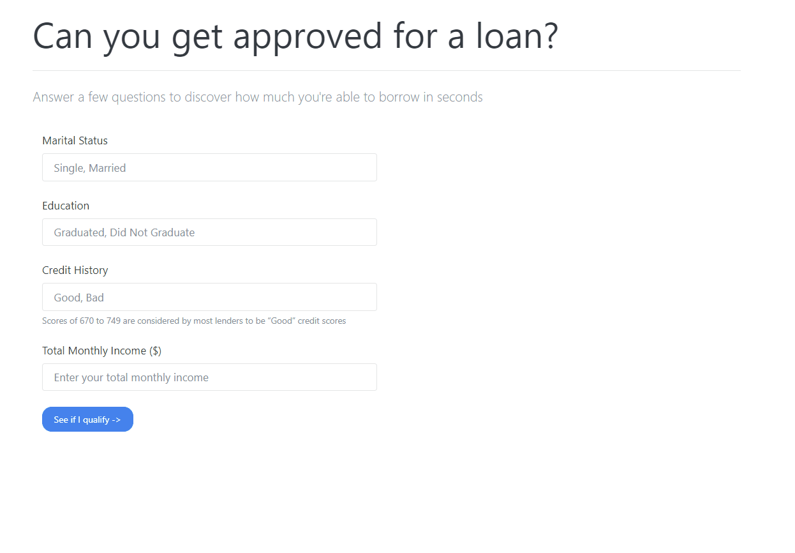
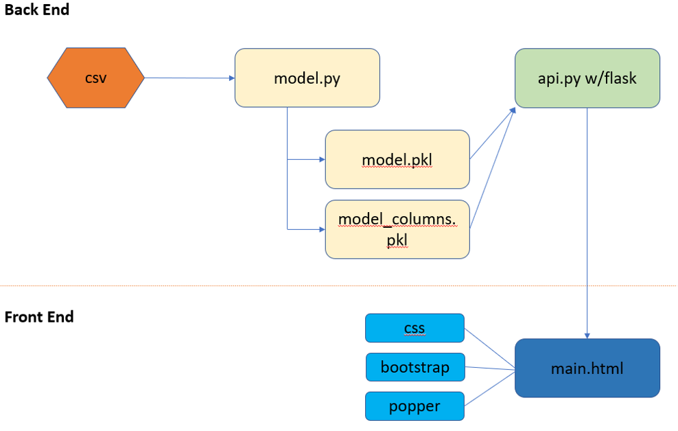
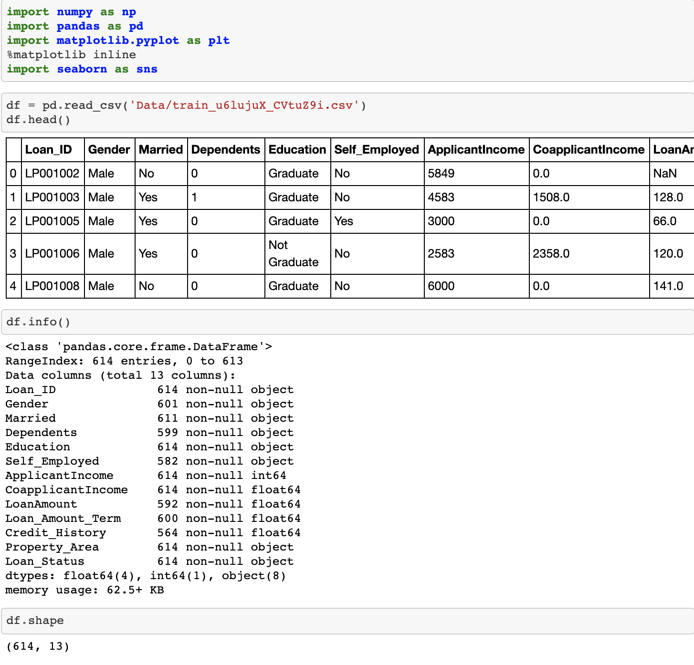
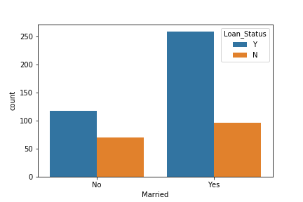
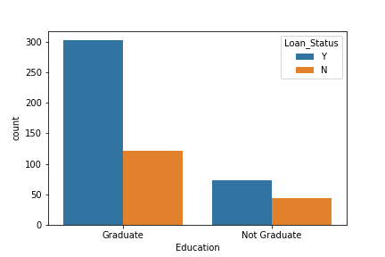
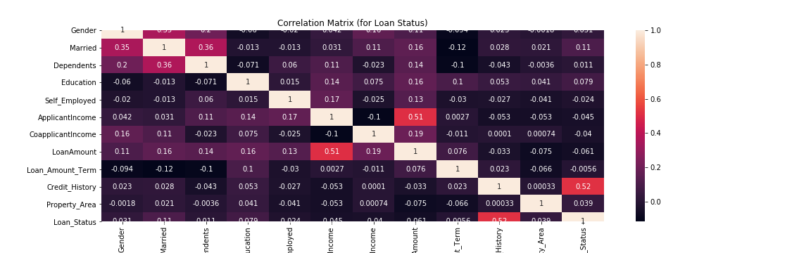

# Loan Prediction Using selected Machine Learning Algorithms

------------------------------
Loan Probability with Machine Learning, without a credit score ding!
<h1> ️Contributers </h1>

[<b>Anastasia V</b>](https://github.com/AnastasiaRV)  

[<b>Anna G</b>](https://github.com/heyannag)  
 
[<b> Masita M </b>](https://github.com/masitamohamad)  
 
[<b> Catie C </b>](https://github.com/csidneyclark)  
 
[<b> Matt O </b>](https://github.com/oconnormatt781)  

# Database Discovery 
Source of Dataset: The dataset for this project is retrieved from [Kaggle](https://www.kaggle.com/altruistdelhite04/loan-prediction-problem-dataset), the home of Data Science. 

Columns | Description | Key Parameter Y/N
:-----|:----- |:-----:
`Loan_ID` | Unique Load ID | N
`Gender` | Male/Female | N
`Married`| Maritail Status Y/N) | Y
`Dependents`| Number of Dependants Claimed | N
`Education` | College Graduate Y/N | Y
`Self_Employed`| Self-Employed Y/N | N
`Applicant_Income` | Applicant Annual Income | Y
`Coapplicant_Income` | Co-Applicant's Income | Y
`Loan_Amount`| Loan Amount in Thousands | Y
`Loan_Amount_Term` | Loan Term in Months | N
`Credit_History`| Meets Criteria (1;0) | N
`Property_Area` | Urban, Semi-Urban and Rural | N
`Loan_Status` | Approved Y/N | Y

# Machine Learning Models 
<b>The problem at hand:</b> The major aim of this project is to predict which of the customers will receive a loan or not. Therefore, this is a supervised classification problem to be trained with algorithm:
<b>Logistic Regression</b>

<b>Predictor problem:</b> linear regression will answer the dollar amount do you qualify for based on total applicant income by using algorithm:
<b>Linear regression</b>

## How it all works together

## Data Cleaning

Read the data and checked the shape. Oh! it has 614 rows and 13 columns. That’s 12 features

<b>Missing Values:</b> Check where there are missing values and fix them appropriately
   
    '''
     df.isnull().sum() #uncover the amount of null values
     df['LoanAmount'] = df['LoanAmount'].fillna(df['LoanAmount'].mean()) # fill in null 'LoanAmount' with column mean
     df['Credit_History'] = df['Credit_History'].fillna(df['Credit_History'].median()) # fill in null 'Credit_History' with column mean
     df.dropna(inplace=True) 
 
 Now all missing values are dropped to avoid errors in the model.

## Exploring the Data

 
As seen above, a Married Person has more chance of getting the loan.

 
Also, a Graduate level degree give the individual more chance of getting the loan. 

## Encoding to numeric Data; getting ready for model training

    '''
    code_numeric = {‘Male’: 1, ‘Female’: 2,
    ‘Yes’: 1, ‘No’: 2,
    ‘Graduate’: 1, ‘Not Graduate’: 2,
    ‘Urban’: 3, ‘Semiurban’: 2,’Rural’: 1,
    ‘Y’: 1, ’N’: 0,
    ‘3+’: 3}
    df_train = df_train.applymap(lambda s: code_numeric.get(s) if s in code_numeric else s)
    df_test = df_test.applymap(lambda s: code_numeric.get(s) if s in code_numeric else s)
    #drop the uniques loan id
    df_train.drop(‘Loan_ID’, axis = 1, inplace = True)

<b>Heatmap:</b> Showing the correlations of features with the target. No correlations are extremely high. The correlations between LoanAmount and ApplicantIncome can be explained.

## Using Logistic Regression

    '''
    model = LogisticRegression()
    model.fit(X_train,y_train)

    lr_prediction = model.predict(X_test)
    print('Logistic Regression accuracy = ', metrics.accuracy_score(lr_prediction,y_test))
 Logistic Regression accuracy =  0.7914110429447853
 
## Using Linear Regression

    '''
    model = LinearRegression()
    model.fit(X_train,y_train)

    lr_prediction = model.predict(X_test)
